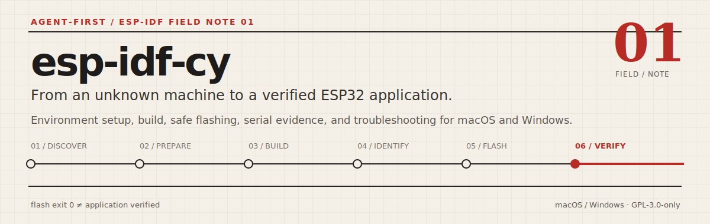
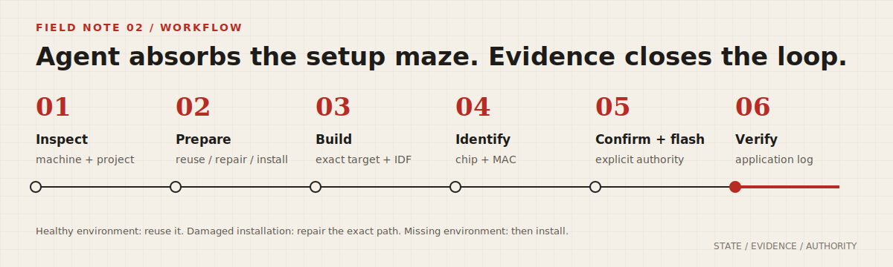
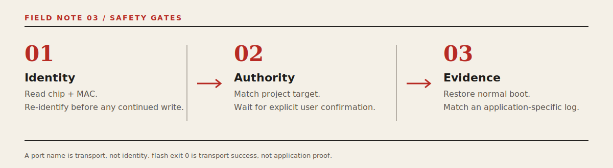

<p align="center">
  
</p>

# esp-idf-cy

`esp-idf-cy` 是一个面向 ESP-IDF 新手和已有工程用户的 Agent Skill。用户通常只需说明板子或芯片、项目位置和目标；Agent 负责侦察或准备 macOS / Windows 开发环境，并把构建、安全烧录、串口证据和排错推进到可验证的结果。

> 它不把 EIM、Python、工具链、环境激活和国内镜像细节甩给新手，也不把 `flash` 退出 0 误报为应用已经运行。

## 它坚持的三个工程决策

| 现场 | `esp-idf-cy` 的处理 |
|---|---|
| 电脑上已有 ESP-IDF | 先真实验证。健康环境原样复用，不为追新静默升级；已安装但损坏时修复精确登记路径。 |
| 用户要写入开发板 | 烧录前读取芯片与 MAC、核对项目 target，并等待用户确认。USB 重枚举后需续写时必须再验身。 |
| 烧录命令成功 | 先确保板子恢复正常启动，再用应用专用健康日志验证。没有应用证据就不报告闭环完成。 |

## 你可以直接这样说

```text
我刚买了 ESP32-S3，Mac 上什么都没装，帮我把环境准备到 hello_world 能编译。
```

```text
帮我检查这个 ESP-IDF 项目，目标是 ESP32-C6，只编译，不要烧录。
```

```text
帮我识别连接的板子。确认是我的那块后再烧录，并抓 30 秒串口日志验证 READY_FOR_TEST。
```

提到 ESP-IDF、`idf.py`、环境安装、编译、烧录、串口、`menuconfig`、`sdkconfig`、`esptool` 或 ESP32 项目排错时，也会触发该 Skill。

## 它如何把任务推进到真实验证

<p align="center">
  
</p>

1. **Inspect**：侦察当前 Agent 能力、平台、项目、IDF 来源、Python、工具链、target 和串口。
2. **Prepare**：区分健康可复用、精确安装损坏、确实缺失三种状态，再决定复用、修复或安装。
3. **Build**：在同一调用中装配正确环境，尊重项目锁定版本和目标芯片。
4. **Identify**：读取芯片型号和 MAC。端口名只是运输通道，不是设备身份。
5. **Confirm + flash**：核对 target，取得用户明确确认后才写入硬件。
6. **Verify**：处理 BOOT/RESET 和 USB 重枚举；最终恢复后不再用 esptool 扰动板子，只靠应用日志收口。

这是一个 **Agent-first Skill**，不是固定安装脚本：

- Agent 负责侦察证据、选择路线、解释异常、取得烧录授权并持续推进。
- `SKILL.md` 规定决策顺序、安全红线和完成标准。
- `references/` 保存会随 ESP-IDF、EIM 和平台变化的知识，执行时仍以实机和当前官方能力复核。
- `scripts/` 承担可重入默认动作，以及验签、argv、身份解析、精确验证和超时等机械边界；不替 Agent 决策。

## 安装

### Codex

```bash
git clone https://github.com/CY-CHENYUE/esp-idf-cy.git ~/.codex/skills/esp-idf-cy
```

已有一份本地 checkout 时，优先用软链接避免多份源码：

```bash
ln -s /你的绝对路径/esp-idf-cy ~/.codex/skills/esp-idf-cy
```

### Claude Code

```bash
git clone https://github.com/CY-CHENYUE/esp-idf-cy.git ~/.claude/skills/esp-idf-cy
```

也可将同一份 checkout 软链接过去：

```bash
ln -s /你的绝对路径/esp-idf-cy ~/.claude/skills/esp-idf-cy
```

安装或更新后新开一个会话，并确认 Skill 列表中出现 `esp-idf-cy`。客户端使用自定义 Skill 目录时，以实际配置为准。

### 从 cc-skills 使用

本项目的日常编辑源位于 `cc-skills/esp-idf-cy`。如果已经克隆完整 `cc-skills`，可让客户端直接扫描该目录，或把其中的 `esp-idf-cy` 软链接到客户端 Skill 目录。

## 平台路由

Skill 会根据实机动态分流，并先把环境判定为“健康可复用 / 已安装但损坏 / 确实未安装”，再决定复用、精确修复或安装；路径、版本与工具能力都必须由当前证据确认。

| 环境 | 默认策略 |
|---|---|
| 已有健康 IDF | 发现并真实验证后复用，不升级、不重装。 |
| Windows x64 | 优先使用官方 EIM；Agent 宿主没有 Bash 时直接走固定 PowerShell helper，不先要求新手学 Bash。 |
| Windows 非 x64 | 先探测架构。当前官方 Windows EIM CLI 资产为 x64，不盲下不兼容可执行文件。 |
| macOS 已有 EIM 或 Homebrew | 实机验证后复用 EIM；有 Homebrew 时可按官方清单准备前置。 |
| macOS 无 EIM / Homebrew | 不静默安装长期包管理器，使用仍受支持的 Command Line Tools / Python + ESP-IDF 官方脚本路线。 |
| 中国大陆网络 | IDF 仓库、工具资产和 pip 优先使用乐鑫官方镜像机制，不为“能下载”绕过 hash 或签名验证。 |

密码、Touch ID、UAC、macOS 安全窗口和许可接受属于系统信任边界，必须由用户本人处理。脚本返回 `ACTION_REQUIRED` / rc=20 时，这是可恢复的人机交接，不是安装失败。

## 烧录前后的三道门禁

<p align="center">
  
</p>

1. **Identity**：读取芯片和 MAC。如果烧录/复位导致 USB 重枚举，续写前必须再验原 MAC；不用新端口名代替身份。
2. **Authority**：核对项目 target，明确告知将要写入的设备，等待用户确认。
3. **Evidence**：手动进入 ROM 下载模式时，烧录结束后可能需要释放 BOOT 再按 RESET/EN 或重新上电。最终恢复后只有命中应用专用健康标志且无 ROM 下载证据，才会报告 `POST_FLASH_READY=yes`。

## 适用与不适用

### 适用

- 从空白 macOS / Windows 电脑准备 ESP-IDF 环境。
- 检查现有 ESP-IDF、Python、工具链和串口是否可用。
- 编译 ESP32、ESP32-S2、ESP32-S3、ESP32-C3、ESP32-C6 等 ESP-IDF 工程。
- 安全识别开发板，经用户确认后烧录。
- 在 Agent 无交互 TTY 时限时采集串口日志。
- 排查 `idf.py`、环境、下载模式、串口、USB 重枚举和国内网络问题。

### 不适用

- Arduino-ESP32 或 PlatformIO 工作流。
- 代替用户设计具体外设驱动或业务代码。
- 在无法验明设备或没有用户确认时写入开发板。
- 代替 Agent 宿主自身需要的 Shell、终端、网络或系统权限。

## 常见问题

### Mac 必须安装 EIM 吗？

不必须。已有健康 IDF 就复用；已有 EIM 或 Homebrew 时可走官方 EIM CLI 路线；EIM 和 Homebrew 都没有时，Skill 不会静默安装新的长期包管理器，而会选择仍受支持的官方脚本路线。macOS EIM 会检查 POSIX 前置，但不会像 Windows `-a true` 那样全部代装。

参考：[乐鑫 EIM 平台与安装说明](https://docs.espressif.com/projects/idf-im-ui/en/latest/index.html)、[macOS/POSIX 前置依赖](https://docs.espressif.com/projects/idf-im-ui/en/latest/prerequisites.html)、[ESP-IDF macOS 安装说明](https://docs.espressif.com/projects/esp-idf/en/latest/esp32/get-started/macos-setup.html)。

### 空白电脑的依赖会自动安装吗？

会尽量自动处理。Windows EIM 可以自动补 Python/Git 等前置；macOS 上可触发 Command Line Tools，复用 Homebrew 安装兼容 Python，或下载并验签 Python.org 官方安装包。系统 UI、管理员授权和许可确认仍需用户本人完成。

### Agent 会操作 EIM GUI 吗？

CLI 是默认且可移植的路线。用户明确要求 GUI、Agent 宿主又具有桌面操作能力时，可操作普通按钮、版本选择和日志页面；密码、Touch ID、UAC 和系统安全确认仍归用户。

### 安装位置或项目位置不一样怎么办？

Skill 从项目 `build/project_description.json`、环境变量、EIM 登记、IDE 配置和受限范围搜索中发现路径；`~/esp` / `C:\esp` 只是最后候选。候选必须通过真实 `idf.py --version` 验证。ESP-IDF 官方不支持 IDF 或项目路径含空格；Skill 会提前拦截，而不会假装“加引号”就能解决。

### 会自动升级已有 ESP-IDF 吗？

不会。健康环境复用当前精确版本和路径；已有项目优先遵循项目锁定版本。EIM 安装损坏时，修复登记的精确路径并在清除外部 `IDF_PATH` 干扰后复检。

### 为什么不直接用 `idf.py monitor`？

Agent 会话通常没有交互 TTY。Skill 附带有界 pyserial 采集器，可按超时和健康正则退出；匹配运行在可终止子进程中，且有采集总超时和 64 KiB 窗口限制。人类需要交互调试时仍可在真实终端使用官方 monitor。

### 烧录成功后为什么还可能要按 RESET？

通过 BOOT 键手动进入 ROM 下载模式时，部分芯片/USB 路径在烧录结束后仍不会重新采样启动引脚。Skill 会明确提示松开 BOOT，按 RESET/EN 或重新上电，再续上应用日志验证。

## 验证边界

仓库自动测试覆盖脚本参数、动态路径发现、空格路径拒绝、macOS EIM 路由、固定 argv relay、Windows EIM 静态约束、精确安装/修复门禁、esptool v4/v5 身份解析、串口控制线极性和烧录后状态机。

这些软件证据不等于所有平台与开发板组合已完成实机验收。外部验收仍应覆盖：

- Windows 11 x64 PowerShell-only 空白机安装与真实构建。
- 空白 macOS 的一条完整受支持路线。
- S3/C3/C6 原生 USB 和 CP210x/CH340 等桥接串口的验身、确认、烧录、重枚举和应用日志闭环。

## 隐私与安全提示

- `doctor.sh` 会输出本机发现的 IDF 路径；网络诊断只探测安装实际使用的 ESP-IDF GitHub 仓库、JihuLab 镜像和乐鑫下载镜像。
- `identify-device.sh` 会读取并输出开发板 MAC。
- `monitor.sh` 会输出串口日志，其中可能含 Wi-Fi、设备标识、业务数据或其他敏感信息。
- `post-flash-check.sh verify` 会将原始日志保存到系统临时目录，并输出 `CAPTURE_LOG` 路径；诊断后可删除。
- 把诊断、终端截图或日志公开粘贴到 Issue、论坛或聊天前，请删除用户名、本机路径、MAC、凭据、网络信息和业务数据。
- Skill 不绕过烧录确认；下载并执行 Windows 安装器前必须经过来源、hash 和签名验证。

## 仓库结构

```text
esp-idf-cy/
├── SKILL.md                    # Agent 入口、决策顺序与安全规约
├── README.md                   # 用户入口
├── LICENSE                     # GPL-3.0-only
├── assets/                     # README 视觉资产与二维码
├── scripts/                    # 侦察、安装、环境、端口、验身和日志工具
├── references/                 # 平台安装、命令、镜像和排错知识
├── tests/                      # 确定性回归与契约测试
└── evals/evals.json            # 典型 Agent 行为评测
```

## 同步来源

本独立仓库是公开发布镜像。canonical source 位于 `cc-skills/esp-idf-cy`；长期修改先进入 `cc-skills`，再通过可审计的同步流程发布，不在两个仓库分别维护。

## 许可

本项目使用 [GNU General Public License v3.0 only](LICENSE)。

## 交流


